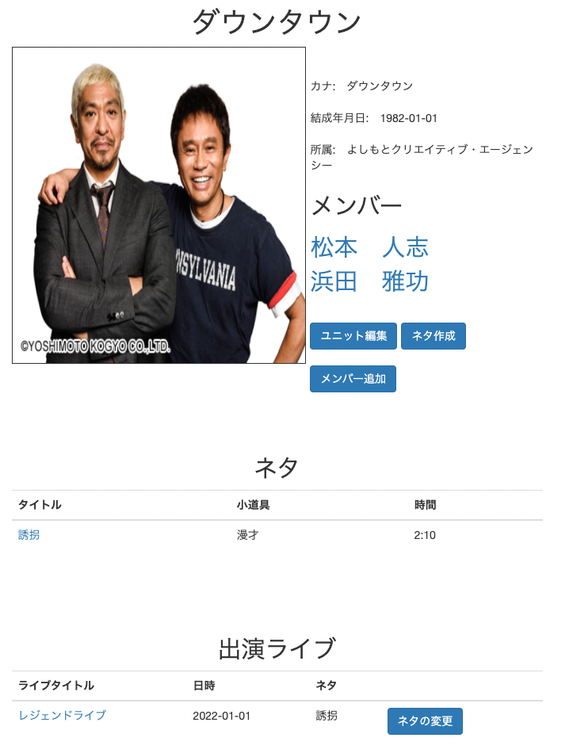
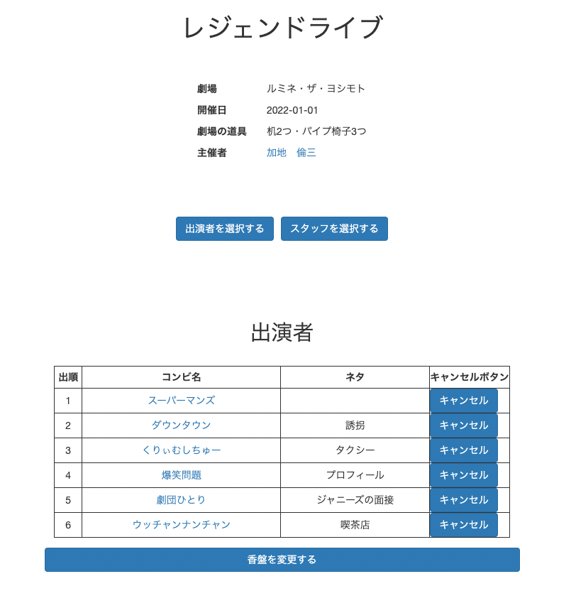

# README

## ライブ・ネタ管理アプリ
私はお笑いが好きで、大学時代にお笑いサークルに所属していました。当時は学内でサークルのメンバーとともにライブを定期的に行ったり、学園祭でライブを行ったりしていました。その時に、コンビを組んでいる相方とのネタの共有が非常に面倒に感じていました。ネタをテキストで共有する手段が、ワードで作成して印刷するか、メモで作成したものをLINEのノートに共有するというものしかありませんでした。  
また、ライブを開催するにあたり、サークルのスタッフの方が出演者の情報をまとめたり、ライブの情報を共有したりと面倒な仕事をこなしてくれていました。  
ライブを行うにあたって重要な点は、演者はネタ作りや出演時のパフォーマンスに集中し、スタッフは必要最低限の仕事をしてライブ自体を楽しめるといったことであると考えます。これらを達成することで、もっと楽しくたくさんのお笑いライブが開催されるようなサービスを作りたいと思い、今回のアプリケーションを作成しました。

## 機能
### ○ 芸人
- 芸人同士でコンビを組んで、情報を共有する（ネタ・ライブ情報）
- 一人の芸人が様々なユニットを組んでそれぞれの情報を管理できる。
- 自分のライブの出演状況がどうなっているのかを把握することができたり、どのライブでどのネタをやるのかを一覧で見ることができるようにする。

### ○スタッフ
- ライブを開催するにあたり、ライブ情報の管理を行いやすくする。
- 複数のスタッフにリアルタイムで情報共有を行うことができる。

## 使用バージョン
Ruby 3.0.2
Rails 6.1.4.4

## テーブル設計
https://github.com/katonaoya/netatyou_app/blob/develop/学んだこと/テーブル設計.md

## heroku
https://netatyou-app.herokuapp.com/users/new

