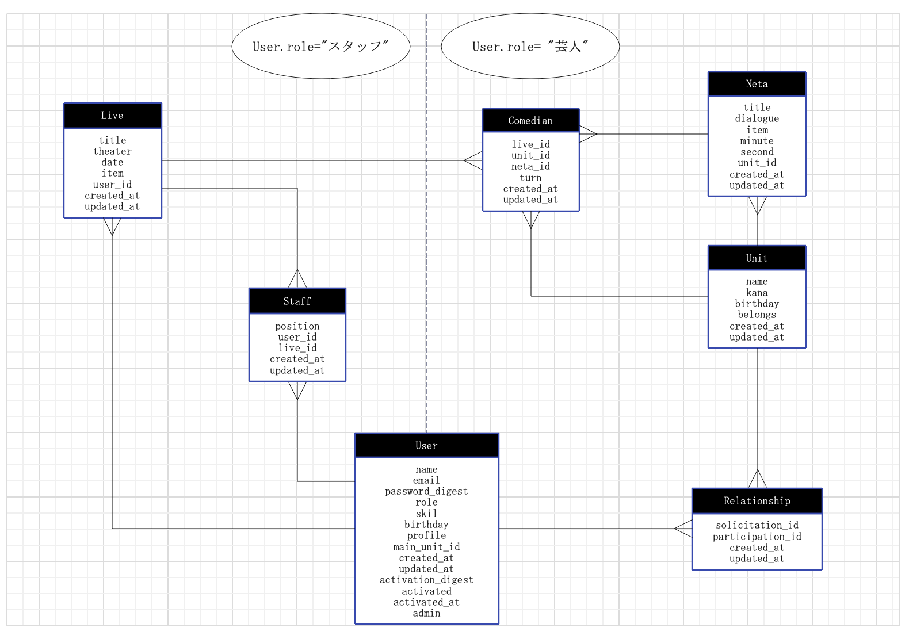

## ER図

## 各テーブルの説明
### Userテーブル
○ テーブルの説明  
- ユーザーの登録を行うことができる。メールアドレスでの認証を行うためのactivationのカラムや管理者権限を付与するadminカラムも入っている。
- 基本的にUserは自分の最低限の情報を登録した後に、自由にプロフィールを編集することができる。
- role(役割)の中には、"芸人"か"スタッフ"のどちらかしか登録することができない。このどちらを選ぶかによって、サービス内でのできることが異なってくる。  
- 基本的に本名での登録をしてもらう。

○ テーブル詳細  
|データ型|カラム名|オプション|説明|
|:-:|:-:|:-:|:-:|
|string|name|null: false|ユーザー名|
|string|email|null: false|メールアドレス|
|string|password_digest|null: false|パスワード|
|string|role|null: false|役割（芸人orスタッフ）|
|string|skill||趣味・特技|
|date|birthday||生年月日|
|text|profile||自己紹介|
|integer|main_unit_id||メインユニットid|
|string|activation_digest||認証トークン|
|boolean|activated|default: false||メールアドレスの認証|
|boolean|admin|default: false, null: false|管理者権限|

### Relationshipテーブル
○ テーブルの説明
- Unitに入っているUserの中間テーブル。ここで、どのユニットにどのUserが入っているのかを管理する。
- 作成の際のカラム名は、unit_idとuser_idでもよかったかもしれないが、違うカラム名の場合でも紐付けできるということを学習するために、別のカラム名をつけた。

○ テーブルの詳細
|データ型|カラム名|オプション|説明|
|:-:|:-:|:-:|:-:|
|integer|solicitation_id||勧誘(unit_id)|
|integer|participation_id||参加(user_id)|

### Unitテーブル
○ テーブル説明
- ユニット（コンビやトリオ等）を作成する。所属や結成年月日など、必要な情報を登録できるようにした。
- 関連付けで、imageを登録できるようにし、宣材写真などを登録できるようにした。
- kanaカラムはライブに参加するユニットを選択する際に、カナ検索するために作成した。検索機能については後ほど実装予定
- ピンで活動している人は、自分しか所属していないUnitを作成してもらう。

○ テーブル詳細
|データ型|カラム名|オプション|説明|
|:-:|:-:|:-:|:-:|
|string|name|null: false|ユニット名|
|string|kana|null: false|ユニット名(カナ)|
|date|birthday|null: false|ユニット結成年月日|
|string|belongs|null: false|所属(事務所等)|

### Netaテーブル
○ テーブル説明
- 各ユニットが作成したネタを保存することができる。
- Unitに所属している人同士でネタを共有し、リアルタイムで更新された内容を見ることができる。
- ネタは、作成したユニットに所属するUserのみが編集や閲覧の権限を持つ。

○ テーブルの詳細
|データ型|カラム名|オプション|説明|
|:-:|:-:|:-:|:-:|
|string|title|null: false|ネタのタイトル|
|text|dialogue|null: false|ネタのセリフ部分|
|string|item||必要な小道具|
|integer|minute||ネタ時間（分）|
|integer|second||ネタ時間（秒）|
|integer|unit_id||ネタを作成したユニットのid|

### Liveテーブル
○ テーブルの説明
- ライブを開催するために必要な情報を登録できる。
- 主な権限は主催者のUserが持っている。
- ライブ会場にある設備の登録があることで、どのようなネタができるのかが分かる。

|データ型|カラム名|オプション|説明|
|:-:|:-:|:-:|:-:|
|string|title|null: false|ライブ名|
|string|theater||ライブ会場|
|date|date||開催日時|
|string|item||会場にある道具|
|integer|user_id||主催者のUser.id|

### Comedianテーブル
○ テーブル説明
- どのライブにどのユニットがなんのネタで出演するかを登録することができる。
- ライブに出演する際に、ネタの提出をすることができる。その際に、必要な小道具やネタ時間の情報もライブ側に共有されるため、ライブエントリーのコミュニケーションコストが削減できる。
- ユニットの出順を登録することができることで、ライブの香盤も作成できる。

○ テーブル詳細
|データ型|カラム名|オプション|説明|
|:-:|:-:|:-:|:-:|
|integer|live_id|null: false|ライブのid|
|integer|unit_id|null: false|出演するユニットのid|
|integer|neta_id||出演するユニットがやるネタのid|
|integer|turn||出演するユニットの出順|

### Staffテーブル
○ テーブル説明
- どのUserがどのライブで何の仕事をするかを選択することができる。
- ライブによっては芸人が手伝いをすることもあるので、スタッフのidに入るUserは全ユーザーが対象

|データ型|カラム名|オプション|説明|
|:-:|:-:|:-:|:-:|
|position|string||ライブでの役割（音響・照明等|
|user_id|integer|null:false|スタッフのid|
|live_id|integer|null:false|ライブのid|
